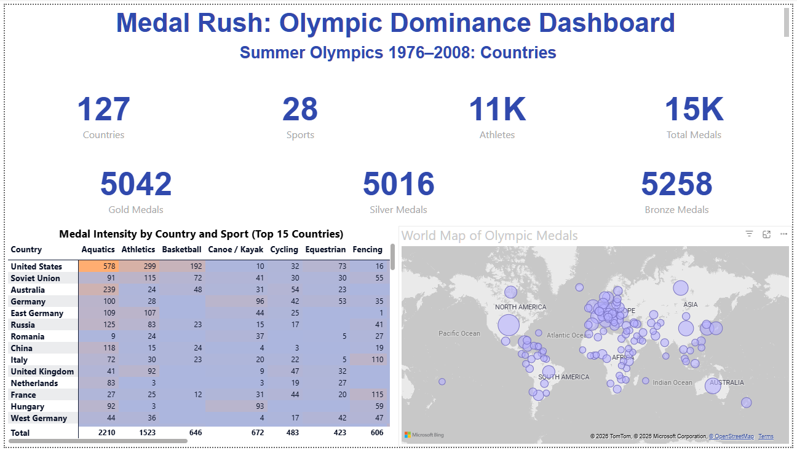

# Olympic Medals Power BI Dashboard

Interactive Power BI analysis of Summer Olympic medals from 1976–2008, covering more than 15,000 medals across 120+ countries and 25+ sports.



## Project Overview

**Objective**  
Analyze Summer Olympic results from 1976–2008 to understand country performance, country–sport dominance patterns, and medal distribution, supporting data-driven decisions for Olympic strategy and investment.

**Dataset**  
Based on the “Summer-Olympic-medals-1976-to-2008.csv” dataset.

- 1976–2008 Summer Olympic Games  
- 120+ participating countries  
- 25+ sports  
- Gold, Silver, and Bronze medal results at athlete level
  
## 🔍 Key Insights

| Question | Answer | Visual |
|----------|--------|---------|
| **Top medal nations?** | USA (2,021), Soviet Union (798), Australia (691) | Bar chart |
| **Peak Olympic years?** | 2008 (2,042 medals), 2004 (2,015), 1996 (1,859) | Year table |
| **USA sport dominance?** | Aquatics (578), Athletics (299), Rowing (192) | Matrix/Heatmap |
| **Most concentrated sports?** | Baseball, Softball, Modern Pentathlon | Sport treemap |

## How to Use This Project

1. Download `dashboard/Olympics_PBI_v2.0.pbix`.
2. Open it in Power BI Desktop.
3. Use slicers at the top of the report to filter by:
   - Country  
   - Sport  
   - Year range (1976–2008)
4. Explore country–sport dominance by moving from:
   - High-level KPIs → matrix and heatmap → country- and sport-focused treemaps.

## How to Use

1. **Download** `Olympics_PBI_v2.0.pbix` 
2. **Open** in Power BI Desktop
3. **Use slicers** to filter by Country, Sport, Year Range
4. **Drill into dominance** using Matrix → Heatmap → Treemaps

## 📈 Interactive Features
```
✅ Country slicer (single/multi-select)
✅ Sport slicer (single/multi-select)
✅ Year range slicer (1976-2008)
✅ Cross-filtering across all visuals
✅ Tooltips with medal breakdown (G/S/B)
✅ Mobile-responsive layout
```
## 🛠️ Technical Details

**Power BI Version**: Desktop (latest)
**Data Model**: 

    1 fact table: Medals (5,179 rows)

    3 dimension tables: Country, Sport, Year

    1 measure: Medal Count = COUNTROWS(Medals)

**DAX Measures**: Medal Count, Gold Medals, Silver Medals, Bronze Medals
**Visuals**: 12 total (Matrix, Heatmap, Treemaps, Line, Map, Bar, Table)

**Core DAX Measures**

- `Medal Count = COUNTROWS(Medals)`  
- `Gold Medals`  
- `Silver Medals`  
- `Bronze Medals`  
- `Total Medals`  
- Additional percentage and ranking measures for analysis.

**Visuals Used**

- KPI cards (Countries, Sports, Athletes, Total Medals, Gold, Silver, Bronze)  
- Matrix and conditional-format heatmap  
- Dual treemaps (country-focused and sport-focused)  
- Line/area charts for medal trends by year  
- World map of Olympic medals  
- Supporting tables and filters.

## Repository Structure
```
Olympics-Medals-Analysis/
│
├── data/
│   ├── raw/
│   │   └── Summer-Olympic-medals-1976-to-2008.csv
│   ├── processed/
│   │   └── Olympics_Cleaned_Data.xlsx
│
├── analysis/
│   └── Olympics_Medals_EDA.xlsx
│   ├── Progression_Summary.xlsx
│   ├── Success_Score.csv
│   └── Country_Year_Medals.xlsx
│
├── dashboard/
│   └── Olympics_PBI_v2.0.pbix
│
├── reports/
│   └── Olympic_Medals_Analysis_Report.pdf
│
├── problem-definition/
│   └── Problem_Statements.xlsx
│
├── README.md
```

## Dashboard Screenshots

### Dashboard Home - Country Performance


### Country-Sport Dominance Matrix + Heatmap


### Dual Treemaps - Country vs Sport Focus


## Skills Demonstrated
```
✅ Power BI Desktop (full end-to-end)
✅ Data modeling (star schema)
✅ DAX measures and calculations
✅ Advanced visuals (Matrix, Heatmap, Treemap)
✅ Slicer synchronization & interactions
✅ Mobile-responsive design
✅ Stakeholder-ready insights
✅ Executive presentation formatting
```
## Results Summary

**Achievement**: Built production-ready dashboard answering 5 core research questions about Olympic performance patterns.

**Impact**: Enables data-driven decisions for national Olympic committees on sport investment priorities and performance benchmarking.

## Related Resources

- [Original Dataset](Summer-Olympic-medals-1976-to-2008.csv)
- [Problem Statement](Problem_Statements_v1.1.xlsx)

## License

MIT License - Feel free to use, modify, and share for learning/portfolio purposes.

---

**Built with** **Power BI** | **1976-2008 Summer Olympics Data**
