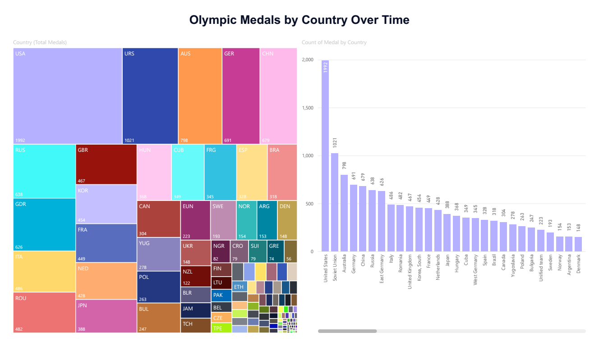
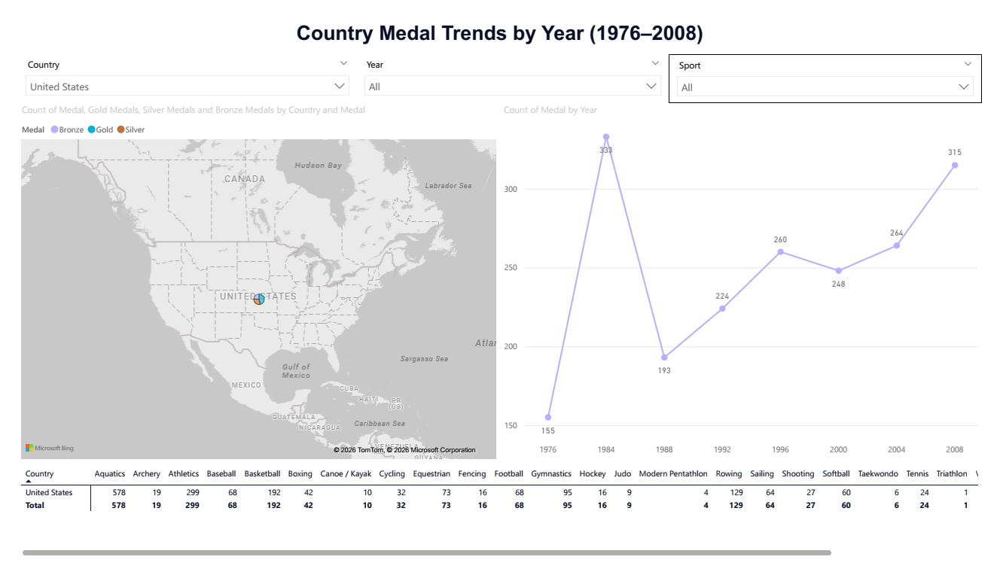
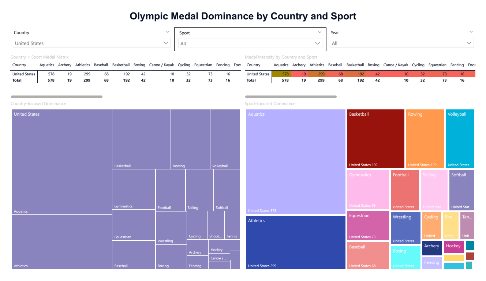

# Olympic Medals Power BI Dashboard

Interactive Power BI analysis of Summer Olympic medals from 1976-2008 (5,179 medals across 31 countries, 26 sports).



## 🎯 Project Overview

**Business Problem**: Identify country-sport dominance patterns and performance trends to inform strategic Olympic investment decisions.

**Dataset**: 5,179 medal records from Summer Olympics 1976-2008
- 31 countries represented
- 26 sports analyzed  
- 3 medal types (Gold, Silver, Bronze)

## 📊 Dashboard Features

### Page 1: Country Medal Trends Over Time

    Country Total Medals bar chart (Top 30 countries)

    Medal Trends by Year line chart (multi-country comparison)

    World bubble map (medals by geography)

    Medals by Year table (1976-2008 totals)

    Slicers: Country, Year Range


### Page 2: Country-Sport Dominance Analysis  

    Country × Sport Medal Matrix (rows=countries, columns=sports)

    Medal Intensity Heatmap (conditional formatting)

    Country-focused Dominance Treemap

    Sport-focused Dominance Treemap

    Slicers: Country, Sport, Year Range


## 🔍 Key Insights

| Question | Answer | Visual |
|----------|--------|---------|
| **Top medal nations?** | USA (2,021), Soviet Union (798), Australia (691) | Bar chart |
| **Peak Olympic years?** | 2008 (2,042 medals), 2004 (2,015), 1996 (1,859) | Year table |
| **USA sport dominance?** | Aquatics (578), Athletics (299), Rowing (192) | Matrix/Heatmap |
| **Most concentrated sports?** | Baseball, Softball, Modern Pentathlon | Sport treemap |

## 🚀 How to Use

1. **Download** `Olympics_PBI_v2.0.pbix` 
2. **Open** in Power BI Desktop
3. **Use slicers** to filter by Country, Sport, Year Range
4. **Drill into dominance** using Matrix → Heatmap → Treemaps

## 📈 Interactive Features
```
✅ Country slicer (single/multi-select)
✅ Sport slicer (single/multi-select)
✅ Year range slicer (1976-2008)
✅ Cross-filtering across all visuals
✅ Tooltips with medal breakdown (G/S/B)
✅ Mobile-responsive layout
```
## 🛠️ Technical Details

**Power BI Version**: Desktop (latest)
**Data Model**: 

    1 fact table: Medals (5,179 rows)

    3 dimension tables: Country, Sport, Year

    1 measure: Medal Count = COUNTROWS(Medals)

**DAX Measures**: Medal Count, Gold Medals, Silver Medals, Bronze Medals
**Visuals**: 12 total (Matrix, Heatmap, Treemaps, Line, Map, Bar, Table)

## 📁 Repository Structure
```
Olympics-Medals-Analysis/
│
├── data/
│   ├── raw/
│   │   └── Summer-Olympic-medals-1976-to-2008.csv
│   ├── processed/
│   │   └── Olympics_Cleaned_Data.xlsx
│
├── analysis/
│   └── Olympics_Medals_EDA.xlsx
│   ├── Progression_Summary.xlsx
│   ├── Success_Score.csv
│   └── Country_Year_Medals.xlsx
│
├── dashboard/
│   └── Olympics_PBI_v2.0.pbix
│
├── reports/
│   └── Olympic_Medals_Analysis_Report.pdf
│
├── problem-definition/
│   └── Problem_Statements.xlsx
│
├── README.md
```

## Dashboard Screenshots

### Dashboard Home - Country Performance


### Country-Sport Dominance Matrix + Heatmap


### Dual Treemaps - Country vs Sport Focus


## 👥 Skills Demonstrated

✅ Power BI Desktop (full end-to-end)
✅ Data modeling (star schema)
✅ DAX measures and calculations
✅ Advanced visuals (Matrix, Heatmap, Treemap)
✅ Slicer synchronization & interactions
✅ Mobile-responsive design
✅ Stakeholder-ready insights
✅ Executive presentation formatting

## 📈 Results Summary

**Achievement**: Built production-ready dashboard answering 5 core research questions about Olympic performance patterns.

**Impact**: Enables data-driven decisions for national Olympic committees on sport investment priorities and performance benchmarking.

## 🔗 Related Resources

- [Original Dataset](Summer-Olympic-medals-1976-to-2008.csv)
- [Problem Statement](Problem_Statements_v1.1.xlsx)

## 📝 License

MIT License - Feel free to use, modify, and share for learning/portfolio purposes.

---

**Built with** 🏅 **Power BI** | **1976-2008 Summer Olympics Data**
